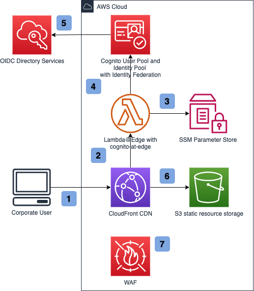

# Sample of a web application protected by Cognito@Edge

This repository contains a sample web application and infrastructure that enables protection of static web resources from public access using Amazon CloudFront Lambda@Edge. Users are authenticated via Amazon Cognito with Identity Federation to a corporate OIDC provider. The web application itself is based on React.js and AWS UI components. 

1. [Architecture](#architecture)
2. [Deploying the infrastructure](#deploying-the-infrastructure)
3. [Deploying the application](#deploying-the-application)
4. [Running the app locally](#running-the-app-locally)
5. [Learn More](#learn-more)
6. [Security](#security)
7. [License](#license)

## Architecture



1. User navigates to the web application. 
2. Lambda@Edge is triggered to check for a valid JWT token in the request cookie.
3. Lambda@Edge fetches User Pool ID, Client ID and User Pool Domain from the SSM Parameter Store. 
4. Lambda@Edge checks the JWT validity. 
5. If there is no valid JWT present, Lambda@Edge navigates the user to the Cognito login screen. Cognito in turn navigates the user to the corporate directory login service.
6. If request contains a valid JWT, CloudFront returns static web site resources from S3 bucket.
7. CloudFront is protected by a WAF rule, configured to allow traffic only from the corporate IP address space. 

## Deploying the infrastructure

> See [./infrastructure/README.md](./infrastructure/README.md) for infrastructure deployment and removal steps. 

## Deploying the application

Once the infrastructure CloudFormation stack is deployed, run the following command:

```sh
./ci/upload_local.sh my-test-app optional-aws-profile
```

This script will:
1. Fetch user pool ID, user pool client ID and CloudFront distribution domain name, and store it at `src/aws-exports.js`.
1. Run `yarn build` to compile the app.
1. Upload the compiled output to the web app static content S3 bucket. 

Once the app is uploaded to the S3 bucket, navigate to the CloudFront distribution address, which you can find in the `cdnfqdnoutput` output of the infrastructure stack. 

## Running the app locally

The web application is using `amplify-js` library for a seamless Amazon Cognito integration, authentication handling, and REST API integration using IAM authentication. `amplify-js` requires a configuration file, which is stored at `src/aws-exports.js`. 

1. In order to generate `aws-exports.js`, in `web` directory, run: 

  ```sh
  ./configure_auth.sh my-test-app optional-aws-profile
  ```

  This script will fetch user pool ID and user pool client ID from the deployed stack, and store it at `src/aws-exports.js`. 

2. In `web` directory, run `yarn start`. Open [http://localhost:3000](http://localhost:3000) to view it in the browser.

## Learn More

* [amplify-js](https://github.com/aws-amplify/amplify-js)
* [Cognito@Edge](https://github.com/awslabs/cognito-at-edge)
* [AWS UI](https://github.com/aws/awsui-documentation)
* [React documentation](https://reactjs.org/).

## Security

See [CONTRIBUTING](CONTRIBUTING.md#security-issue-notifications) for more information.

## License

This library is licensed under the MIT-0 License. See the LICENSE file.